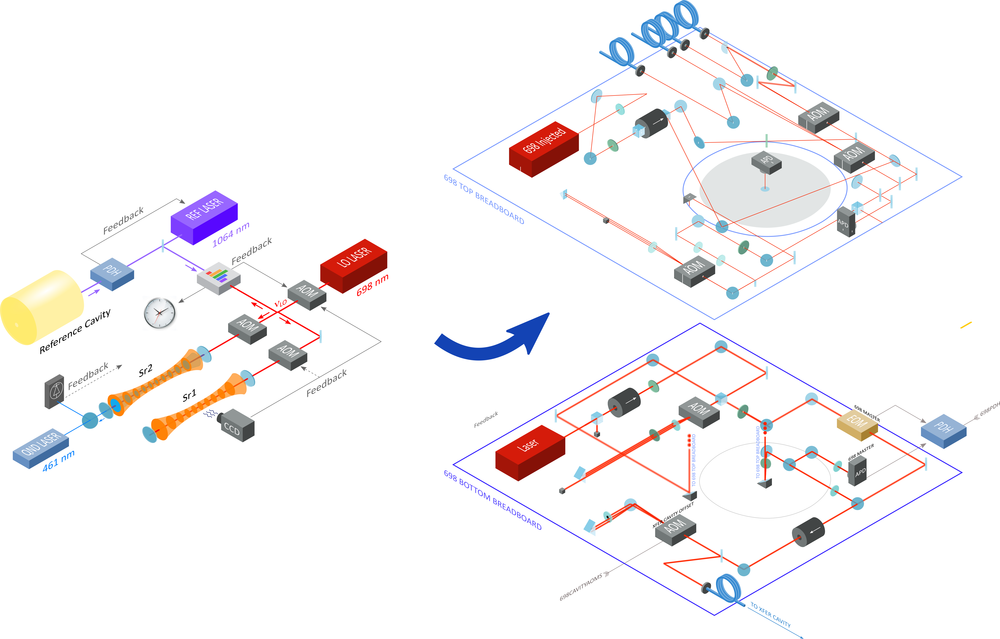
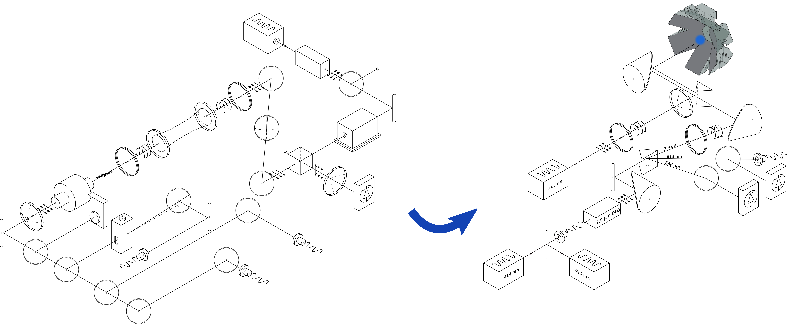

# ComponentLibrary

An improved vector graphics library for illustrations of optics experiments.

ComponentLibrary is a free, open collection of images for drawing diagrams related to laser optics, including many optics but also electronic components. The images are provided as vector graphics, as Scalable Vector Graphics (svg), to be used with free tools such as Inkscape.

## 2D library

## 3D Library

## WIREframe Library

# License

The 2D sub-library provided here, is a derivative of the well known [gwoptics ComponentLibrary](http://www.gwoptics.org/ComponentLibrary/) developed by Alexander Franzen , and used under its [Creative Commons Attribution-NonCommercial 3.0 Unported License](https://creativecommons.org/licenses/by-nc/3.0/). The original library has been extended with additional optics and electronic components.

ComponentLibrary by Alvise Vianello is licensed under a [Creative Commons Attribution-NonCommercial 4.0 International License](https://creativecommons.org/licenses/by-nc/4.0/)

Although always appreciated - we explicitly waive the requirement for attribution when the library is used to create a small number of illustrations for a new work, such as a research paper or a web page. However in all other cases, for example, when the library or its components are distributed, or if the library is used to illustrate major parts of a larger work, such as a book or PhD thesis, the creator Alvise Vianello must be acknowledged as specified in by the Creative Commons license above.
